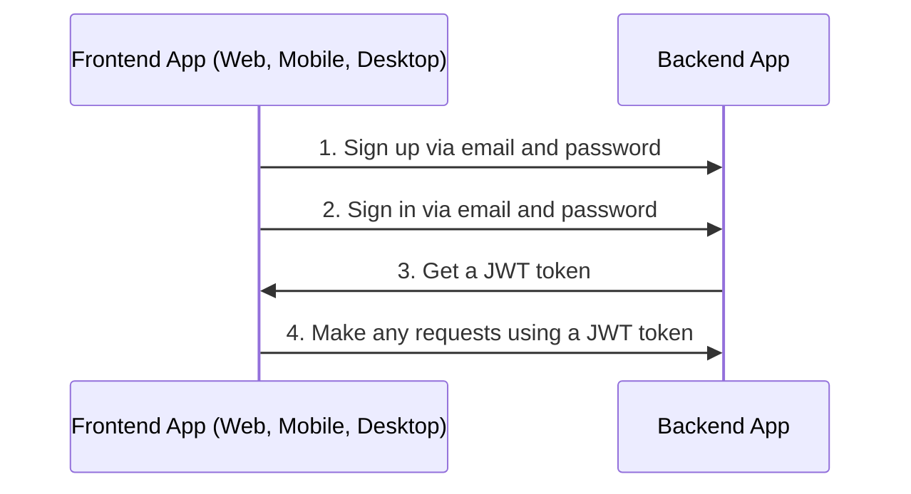
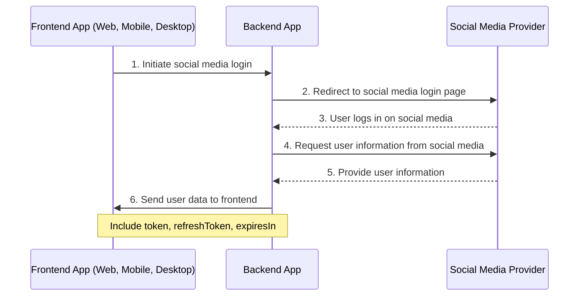
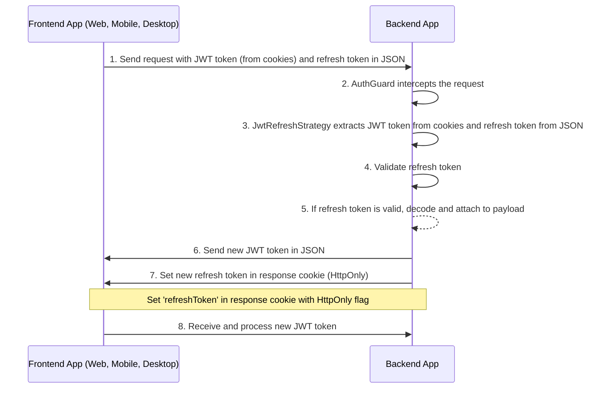
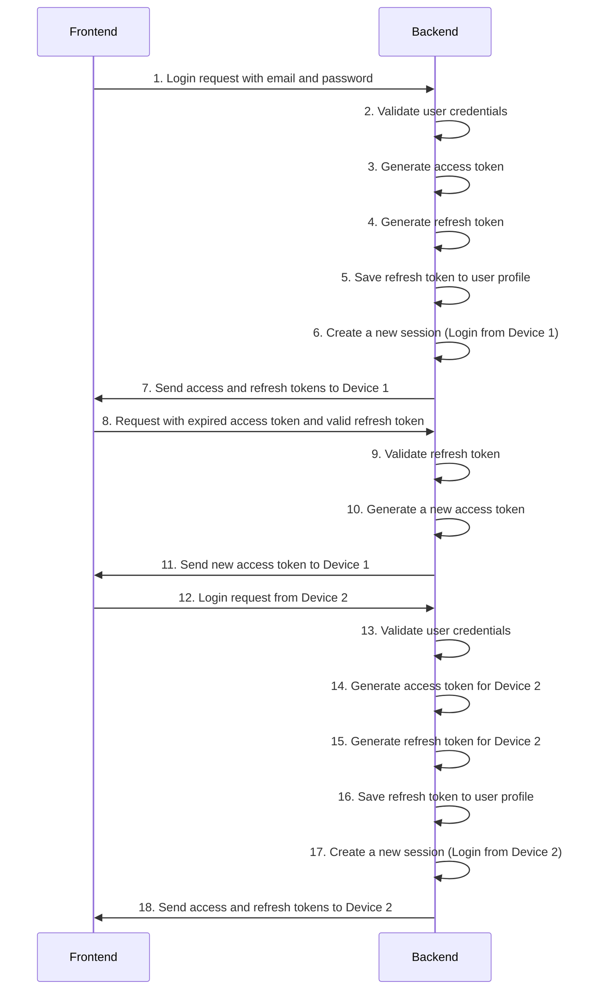

# NestJS REST API Auth Portal

## Description

NestJS REST API boilerplate for typical project

Frontend (React, Next.js): https://github.com/mahmodghnaj/Auth-Portal-client

## Features

- [x] Database ([mongoose](https://www.npmjs.com/package/mongoose)).
- [x] Config Service ([@nestjs/config](https://www.npmjs.com/package/@nestjs/config)).
- [x] Mailing ([nodemailer](https://www.npmjs.com/package/nodemailer)).
- [x] Sign in and sign up via email.
- [x] Social sign in (Facebook,Github).
- [x] Login and handling multiple devices.

## Quick run

```bash
git clone  https://github.com/mahmodghnaj/Auth-Portal-Server my-app
cd my-app/
cp env-example .env
npm install
```

```bash
npm run start:dev
```

## General info

### Auth email flow

By default boilerplate used sign in and sign up email and password.



### Auth via external services or social networks flow

Also you can sign up via another external services or social networks like Google and Github.



## Refresh token flow



## illustrate the process of login and handling multiple devices


